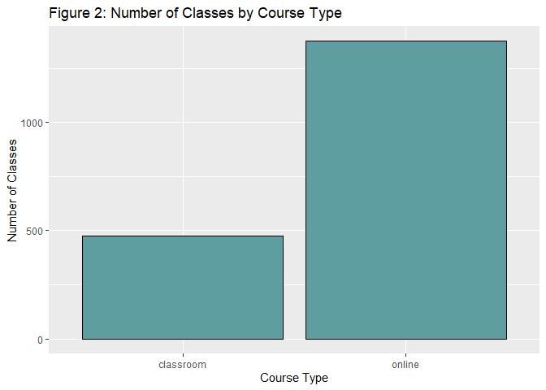

Classification
================
Ryan Kurtzman
2023-08-02

#### **Data**

This dataset contains 8 columns and 1850 rows, I have checked each
column against what it should be and cleaned accordingly:

- course_id: No missing values, values were interpreted as characters,
  changed to factor
- course_type: No missing values, values were interpreted as character,
  changed to factor
- year: No missing values, values are interpreted as numeric and
  converted to factor
- enrollment_count: No missing values, values are numeric
- pre_score: 130 missing values changed to 0, values are interpreted as
  character and changed to numeric
- post_score: 185 missing values changed to 0, values are numeric
- pre_requirement: 89 missing values changed to None, values are
  interpreted as character, changed to factor
- department: No missing values, Math is changed to Mathematics, values
  are character, changed to factor

#### **Visualizations**

<!-- -->

This appears to have two separate distributions together, rerunning the
code and coloring by course type yields an easier to view distribution.

<!-- -->

This shows that online had much higher enrollment counts than classroom
courses. The minimum course enrollment for online classes is around 30
people higher than the maximum for classroom courses. Both of these
distributions are relatively small, with in person classes being
centered around 170 and online classes being centered around 250.

<!-- -->

From this graph we can see that there were far more online classes than
in person classes, almost three times as many. This means that
observations are not balanced across course type.

<!-- -->

Both figures 3 and 1.2 show that online courses have much higher
enrollment counts than in person classes.

#### **Models**

Predicting how many students will enroll is a regression type problem in
machine learning.

For the baseline model I chose a linear regression model because it is
quite simple to perform and see the results of. Using this model we find
a root mean squared error of 0.317. For the comparison model I used a
tree based regression model because it can capture more complex
relationships between the variables rather quickly. The tree based
regression model had a root mean squared error of 6.529. As the linear
regression model had the lower RMSE, it is superior in predicitng
enrollment.
